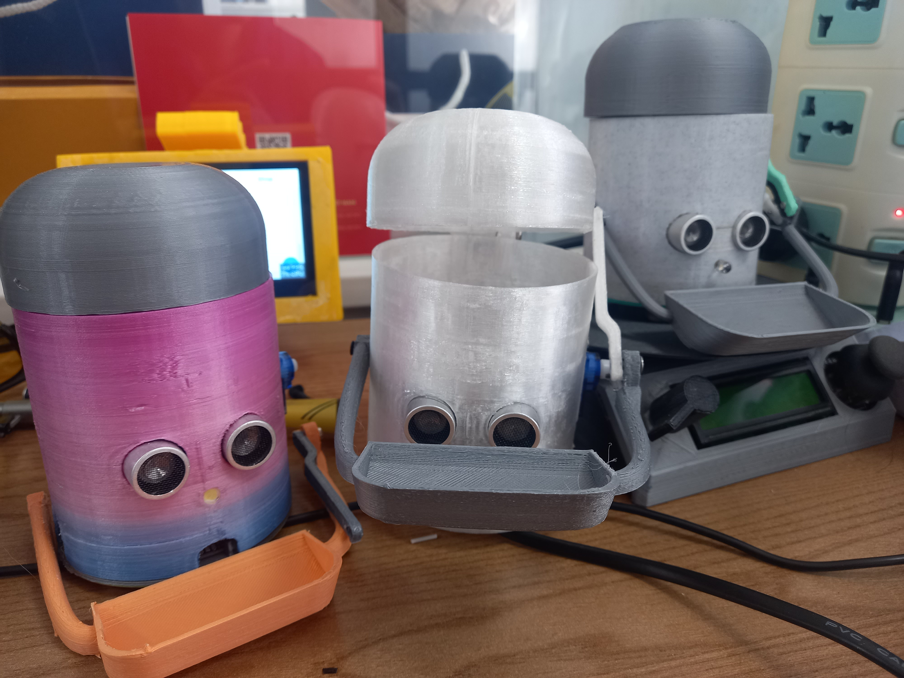
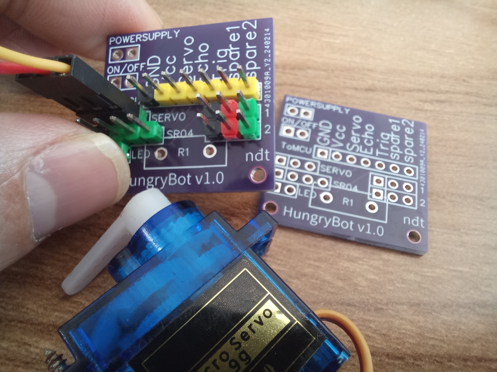
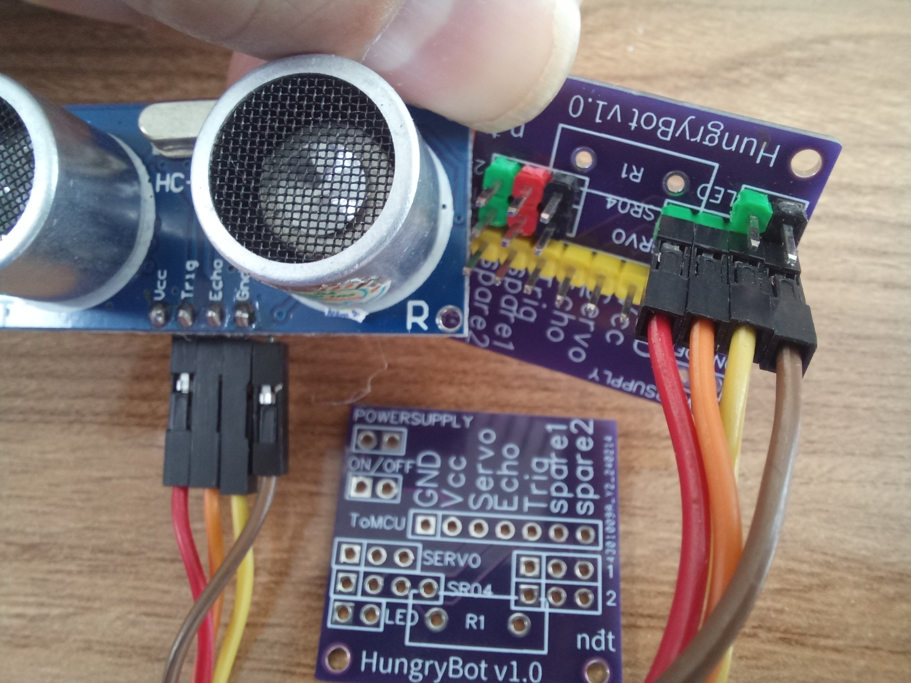
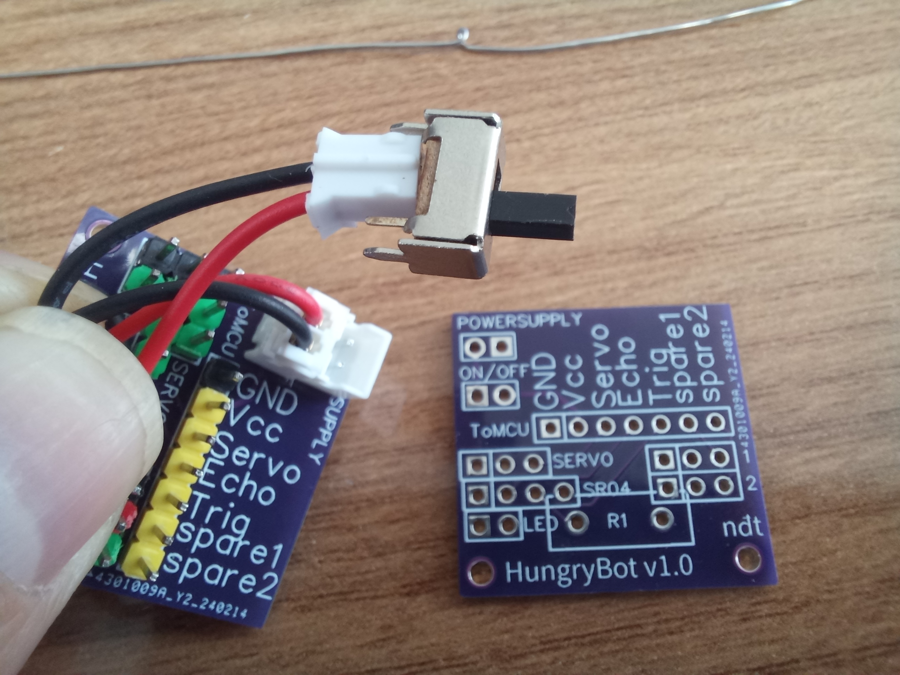
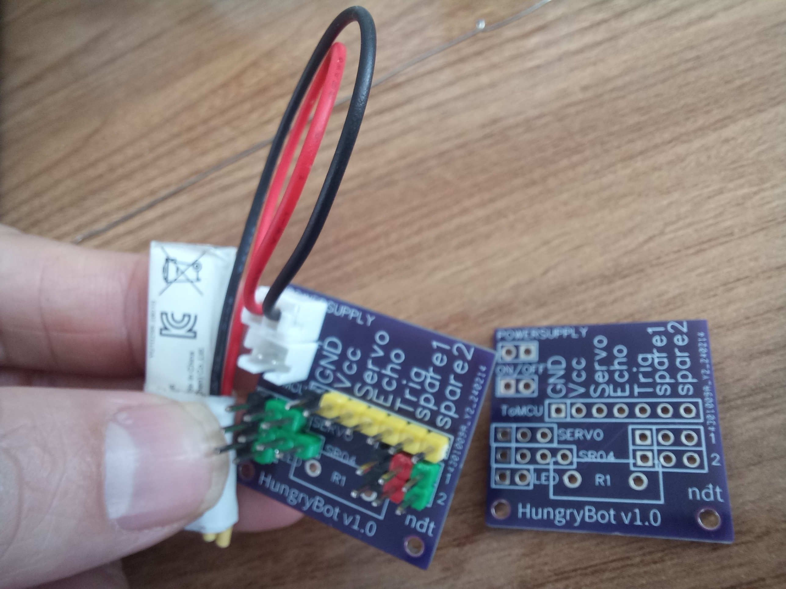
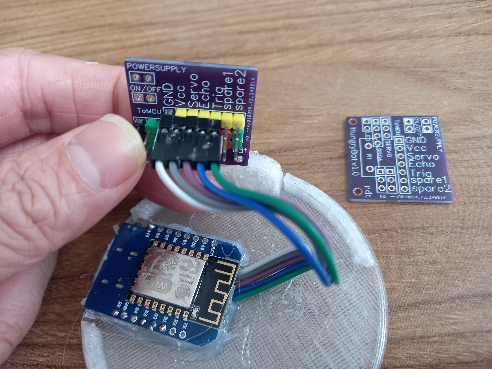
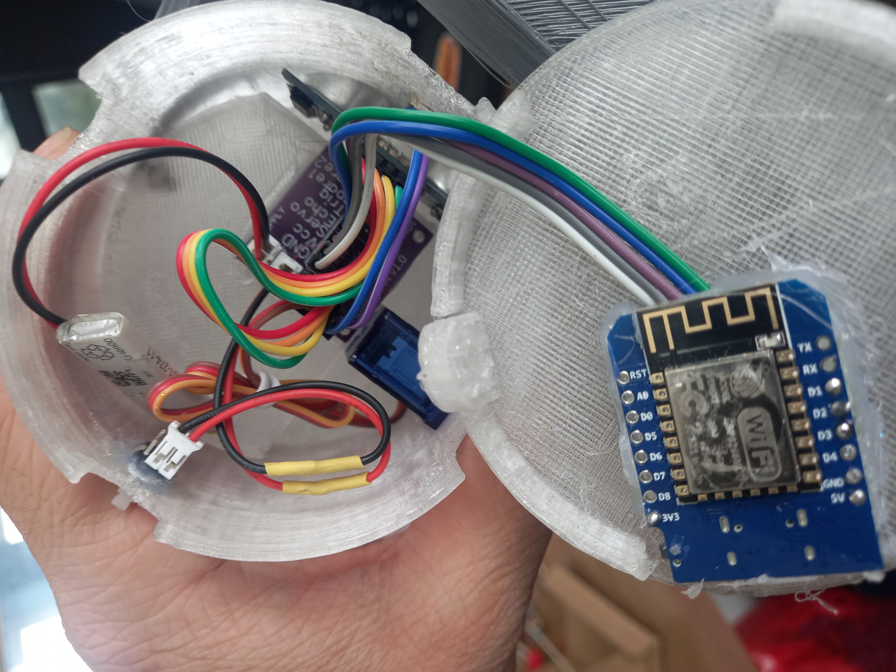
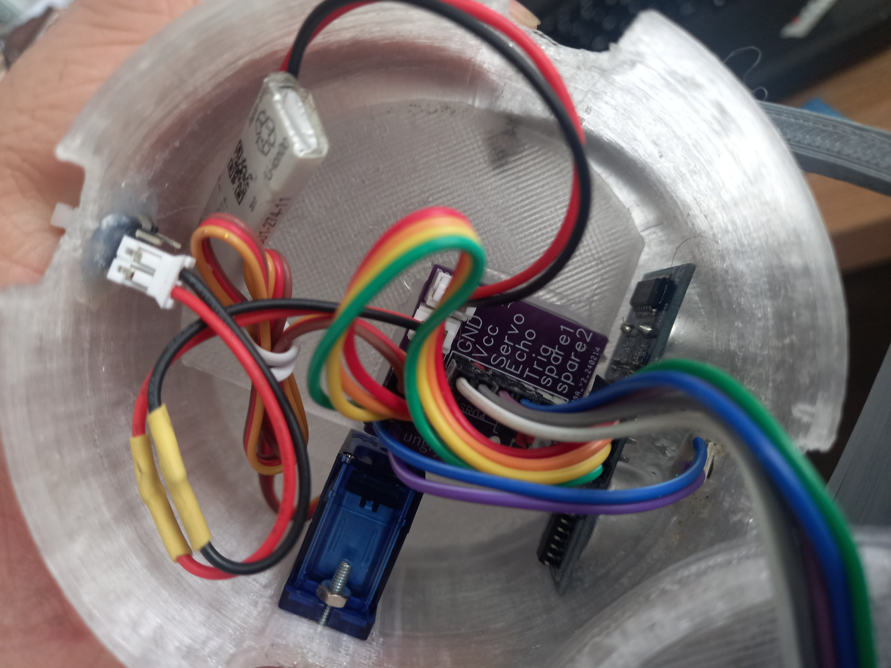

# Hungry Bot Recycle Bin

 

## Overview

- This source code used for [Wemos Lolin D1 R2 mni](https://neittien0110.github.io/MCU/ESP8266/Wemosd1r2mini.html)\
  \
  [Xem hướng dẫn](https://neittien0110.github.io/MCU/ESP8266/Wemosd1r2mini.html)

## Video

- [Demo](https://youtu.be/PHz48JWzXpA)

## Bill of Material

|Name|Qty|Mapping| Code |
|----|----|----|----|
|Wemos D1 R2 mini | 1 (*) |  |  |
|Servo SG90s | 1 (*) | D3 (or GPIO0) | #define PIN_SERVOHAND = D3 |
|Ultrasonic Distance Sensor SR-04 | 1 (*) |ECHO = D2 (or GPIO4)   TRIG = D1 (or GPIO5) | #define PIN_ECHO D2   #define PIN_TRIG D1 |
|Led 5mm | 1 | D1 (or GPIO5) | #define PIN_LED = D1 |

- [3D printed parts](https://www.thingiverse.com/thing:5160440)

*: mandatory

## HungryBotShield

[HungryBotShield Schematic and PCB](https://oshwlab.com/neittien0110/hungryboardshield)

### How to assembly

1. A shield \
  
1. Connect to servo.\
   
1. Connect to HC-04.\
   
1. Connect to button/dip switch.\
   
1. Connect to battery.\
   
1. Connect to Micro Processor - Wemos D1 R2 mini.\
   
1. Already\
    
    
